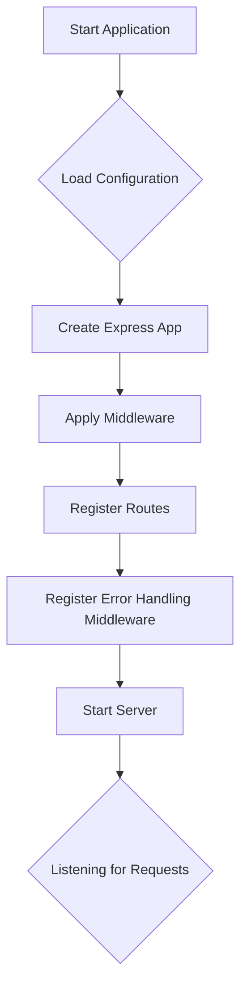

# Application Lifecycle

The application lifecycle describes the sequence of events that occur from the time the application is started until it is shut down. Understanding the lifecycle is crucial for debugging and extending the application.

## Startup

The application startup process is initiated by running the `src/http.ts` file. The following steps are executed:

1.  **Load Configuration**: The `loadConfig` function is called to load the application configuration from the YAML files.
2.  **Create Express App**: An Express application instance is created.
3.  **Apply Middleware**: The following middleware are applied to the Express app:
    *   `express.json()`: Parses incoming requests with JSON payloads.
    *   `express.urlencoded()`: Parses incoming requests with URL-encoded payloads.
    *   `helmet()`: Secures the application by setting various HTTP headers.
    *   `httpLoggerMiddleware`: Logs incoming HTTP requests.
    *   `cors()`: Enables Cross-Origin Resource Sharing.
4.  **Register Routes**: The application routes are registered.
5.  **Register Error Handling Middleware**: The `notFoundMiddleware` and the global error handler are registered.
6.  **Start Server**: The Express server is started and begins listening for incoming requests on the configured port.

## Request Handling

When a request is received, it goes through the following steps:

1.  **Middleware**: The request is processed by the configured middleware.
2.  **Routing**: The request is routed to the appropriate controller based on the URL.
3.  **Controller**: The controller processes the request and returns a response.
4.  **Response**: The response is sent back to the client.

## Shutdown

The application can be shut down by stopping the Node.js process. When the process is stopped, the Express server will stop listening for new requests and the application will exit.

## Visualization

